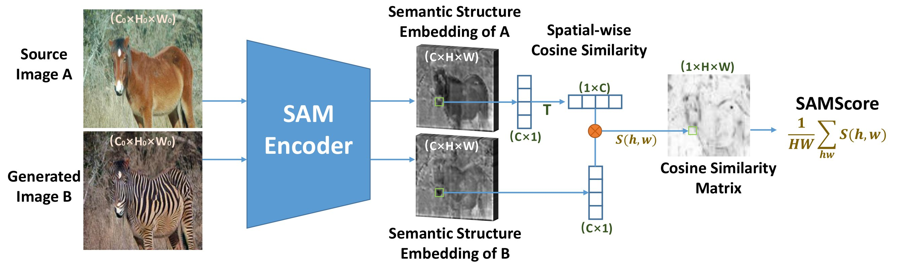
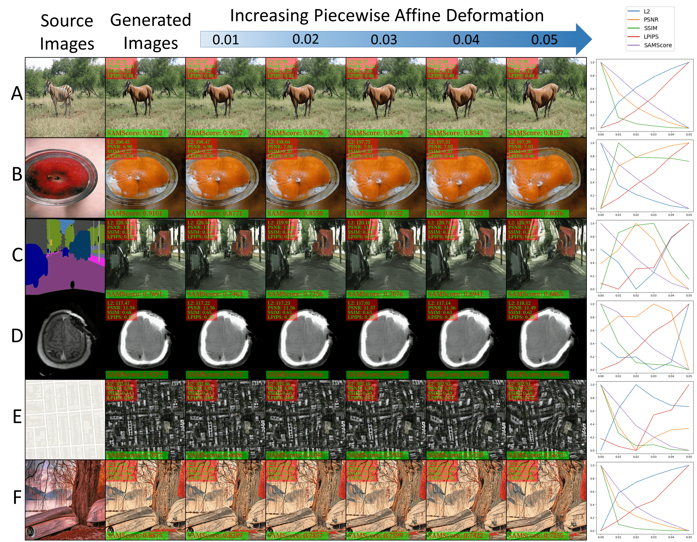

## SAMScore: A Semantic Structural Similarity Metric for Image Translation Evaluation

[Yunxiang Li](https://www.yunxiangli.top/), Meixu Chen, Wenxuan Yang, Kai Wang, [Jun Ma](https://scholar.google.com/citations?hl=zh-CN&user=bW1UV4IAAAAJ), [Alan C. Bovik](https://www.ece.utexas.edu/people/faculty/alan-bovik), [You Zhang](https://profiles.utsouthwestern.edu/profile/161901/you-zhang.html). 

<div>
    <a href="https://arxiv.org/pdf/2305.15367.pdf"></a> 
      <br>
    <a href="https://colab.research.google.com/github/Kent0n-Li/SAMScore/blob/main/SAMScore.ipynb#scrollTo=mCidlfXu88UY"></a>
  </div>

  
  


### Quick start

Run `pip install samscore`.
```python
pip install samscore
pip install git+https://github.com/facebookresearch/segment-anything.git
```

The following Python code is all you need.
```python
import requests
import os
import samscore

def download_image(url, save_path):
    response = requests.get(url)
    response.raise_for_status()  # Raise an exception if the request was unsuccessful

    with open(save_path, 'wb') as file:
        file.write(response.content)
os.makedirs('imgs', exist_ok=True)
# Example usage
image_url = 'https://i.ibb.co/yFFg5pn/n02381460-20-real.png'
save_location = 'imgs/real.png'
download_image(image_url, save_location)

image_url = 'https://i.ibb.co/GCQ2jQy/n02381460-20-fake.png'
save_location = 'imgs/fake.png'
download_image(image_url, save_location)

## Initializing the model
# You can choose "vit_t", "vit_l", "vit_b", "vit_h"
SAMScore_Evaluation = samscore.SAMScore(model_type = "vit_t" )
samscore_result = SAMScore_Evaluation.evaluation_from_path(source_image_path='imgs/real.png',  generated_image_path='imgs/fake.png')

print('SAMScore: %.4f'%samscore_result)
```

Use it on pytorch
```python
import requests
import os
import samscore
import cv2
import torch

def download_image(url, save_path):
    response = requests.get(url)
    response.raise_for_status()  # Raise an exception if the request was unsuccessful

    with open(save_path, 'wb') as file:
        file.write(response.content)
os.makedirs('imgs', exist_ok=True)
# Example usage
image_url = 'https://i.ibb.co/yFFg5pn/n02381460-20-real.png'
save_location = 'imgs/real.png'
download_image(image_url, save_location)

image_url = 'https://i.ibb.co/GCQ2jQy/n02381460-20-fake.png'
save_location = 'imgs/fake.png'
download_image(image_url, save_location)


# You can choose "vit_t", "vit_l", "vit_b", "vit_h"
SAMScore_Evaluation = samscore.SAMScore(model_type = "vit_t" )

source_cv2 = cv2.imread('imgs/real.png')
source = torch.from_numpy(source_cv2.transpose(2, 0, 1)).unsqueeze(0).float()
source = torch.cat((source,source,source),dim=0)

generated_cv2 = cv2.imread('imgs/fake.png')
generated = torch.from_numpy(generated_cv2.transpose(2, 0, 1)).unsqueeze(0).float()
generated = torch.cat((generated,generated,generated),dim=0)

samscore_result = SAMScore_Evaluation.evaluation_from_torch(source,  generated)

print('SAMScore:',samscore_result)
```

## Citation

If you find this repository useful for your research, please use the following.

```
@article{li2023samscore,
  title={SAMScore: A Semantic Structural Similarity Metric for Image Translation Evaluation},
  author={Li, Yunxiang and Chen, Meixu and Yang, Wenxuan and Wang, Kai and Ma, Jun and Bovik, Alan C and Zhang, You},
  journal={arXiv preprint arXiv:2305.15367},
  year={2023}
}
```





